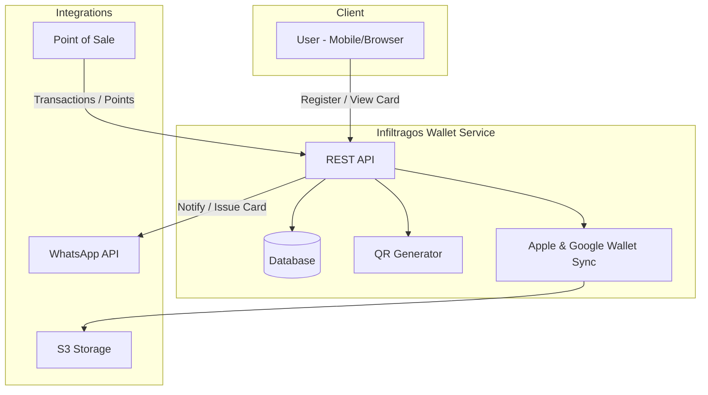
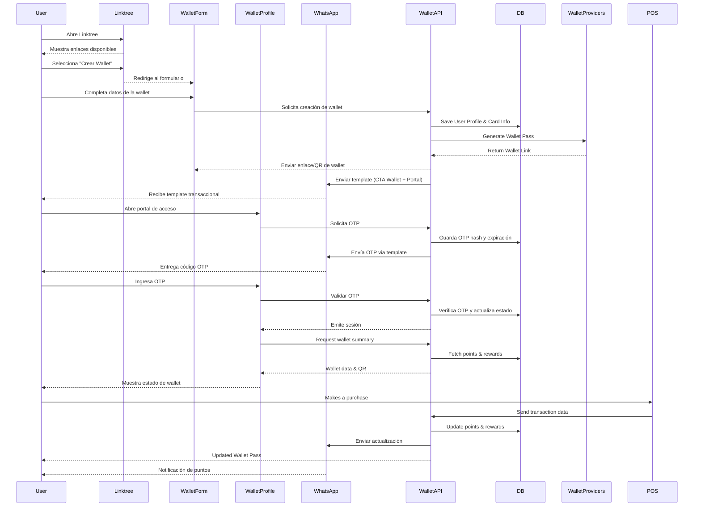
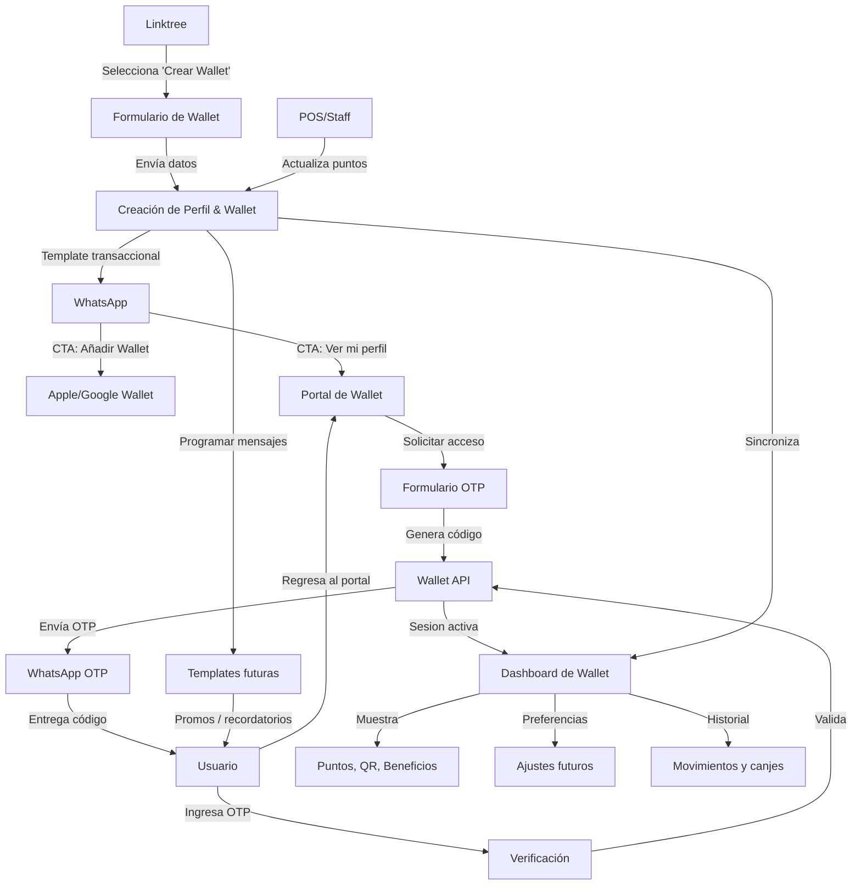
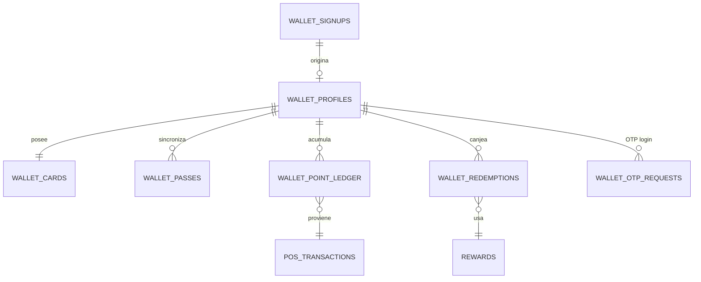

# Infiltragos Wallet Module

## Overview
El módulo **Wallet** de Infiltragos permite la gestión de tarjetas de fidelización digitales para los clientes del bar, centralizando puntos, membresías y beneficios. Incluye integración con Apple Wallet y Google Wallet, facilitando a los usuarios agregar sus tarjetas digitales a sus dispositivos y recibir notificaciones o actualizaciones en tiempo real.

---

## Architecture Overview
El módulo Wallet es parte integral del ecosistema digital de Infiltragos. Se comunica con otros servicios como el sistema de sorteos, el bot de WhatsApp y el panel administrativo. Su arquitectura permite la emisión, actualización y canje de tarjetas digitales, así como la integración con plataformas externas.

### Arquitectura General

---

## Data Flow
El flujo de datos típico desde el registro hasta el canje de recompensas es el siguiente:

1. El usuario ingresa a Linktree.
2. Completa el formulario web de creación de wallet.
3. El backend genera su tarjeta digital con QR, crea el perfil y agenda un template transaccional por WhatsApp.
4. El usuario recibe el template, añade la tarjeta a Apple/Google Wallet y puede abrir el portal de perfil.
5. Para ingresar al portal solicita un código OTP; la API lo genera, guarda y envía por WhatsApp.
6. El usuario ingresa el OTP, obtiene acceso y visualiza su información de wallet.
7. Cada consumo registrado por POS actualiza puntos, y el usuario recibe notificaciones salientes por WhatsApp.

### Diagrama de Flujo de Datos

---

## Flujo de Usabilidad del Usuario

1. **Descubrimiento:** El usuario llega a Linktree y selecciona el enlace “Crear Wallet”.
2. **Alta:** Completa el formulario con nombre, celular y correo para crear su perfil.
3. **Activación inicial:** Recibe un template de WhatsApp con dos CTAs transaccionales: `Añadir a mi Wallet` y `Ver mi perfil`.
4. **Educación:** El mensaje refuerza por qué agregar la wallet es clave (beneficios, recordatorios y acceso rápido en el bar).
5. **Acceso con OTP:** Al abrir el portal solicita un código OTP (enviado por WhatsApp), lo ingresa y accede sin contraseña.
6. **Perfil:** Visualiza puntos, QR y próximas promociones en el dashboard.
7. **Uso continuo:** El POS actualiza los puntos tras cada consumo y la wallet refleja los cambios en tiempo real.
8. **Engagement:** WhatsApp envía recordatorios, campañas o nuevos OTP usando plantillas aprobadas (canal solo saliente).

Este flujo permite iterar con nuevas funcionalidades (más datos en el perfil, historial detallado, preferencias de comunicación) sin añadir fricción de contraseñas.

---

### Diagrama de Usabilidad

---

## Core Entities

| Entidad         | Función                                                          |
|-----------------|------------------------------------------------------------------|
| **users**       | Almacena datos de los clientes registrados (nombre, contacto, etc). |
| **wallet_cards**| Guarda la información de la tarjeta digital emitida a cada usuario (códigos, QR, links de Wallet, estado). |
| **transactions**| Registra cada consumo, compra o movimiento de puntos realizado por el usuario. |
| **rewards**     | Define los premios, beneficios o niveles disponibles para canje.  |
| **redemptions** | Guarda el historial de canjes de recompensas o beneficios por parte del usuario. |
| **wallet_signups** | Captura los leads provenientes del formulario inicial (nombre, celular, correo) y sirve como registro de auditoría. |
| **wallet_profiles** | Representa la cuenta activa del usuario (celular verificado, preferencias, estado OTP). |
| **wallet_passes** | Traza los enlaces generados para Apple/Google Wallet, incluyendo su estado y fechas de sincronización. |
| **wallet_point_ledger** | Historial de movimientos de puntos (débitos/créditos) vinculados al consumo del usuario. |
| **wallet_otp_requests** | Controla envíos de códigos OTP (hash, expiración, intentos) para acceso sin contraseña. |

---

## Modelo Relacional (Propuesta)

### Tabla resumen

| Tabla | Campos clave | Relación principal |
|-------|--------------|--------------------|
| `wallet_signups` | `id`, `full_name`, `phone_number`, `email`, `created_at` | Fuente inicial de datos; cada registro da pie a la activación. |
| `wallet_profiles` | `id`, `signup_id`, `phone_number`, `status`, `phone_verified`, `last_login_at` | 1:1 con `wallet_signups`; gestiona autenticación OTP y preferencias. |
| `wallet_cards` | `id`, `profile_id`, `qr_code`, `card_state`, `expires_at` | 1:1 con `wallet_profiles`; describe la tarjeta digital vigente. |
| `wallet_passes` | `id`, `profile_id`, `provider`, `pass_url`, `last_synced_at` | 1:N para los distintos proveedores (Apple/Google). |
| `wallet_point_ledger` | `id`, `profile_id`, `source`, `points_delta`, `balance_after`, `reference_id` | 1:N registra cada movimiento con referencia al POS/transacción. |
| `wallet_rewards` | `id`, `name`, `points_required`, `active_from`, `active_to` | Define beneficios disponibles para canje. |
| `wallet_redemptions` | `id`, `profile_id`, `reward_id`, `points_spent`, `redeemed_at`, `status` | N:1 con `wallet_profiles` y `wallet_rewards`; guarda los canjes. |
| `wallet_otp_requests` | `id`, `profile_id`, `destination`, `code_hash`, `expires_at`, `attempts`, `consumed_at` | Controla cada OTP enviado por WhatsApp y evita abuso. |
| `pos_transactions`* | `id`, `external_id`, `profile_id`, `total_amount`, `earned_points`, `occurred_at` | *Registro externo (POS) que dispara movimientos en el ledger. |

> \*Puede ser una tabla propia o una integración con el sistema de ventas según la arquitectura final.

Este modelo permite evolucionar de la captura inicial (signups) hacia una cuenta autenticada por OTP, vinculando los elementos clave: tarjeta digital, sincronización con proveedores, movimientos de puntos y canjes de recompensas. Cada tabla mantiene la trazabilidad necesaria para auditoría, soporte y personalización futura.

---

## Pantallas Propuestas

1. **Formulario de alta (`/wallet`):** tres campos (nombre, celular Perú +51 fijo, correo) y copy que anticipa el mensaje por WhatsApp.
2. **Confirmación inmediata:** modal/toast que refuerza los beneficios y explica los dos botones que recibirá en WhatsApp.
3. **Template WhatsApp – Activación:** cuerpo educativo + botones “Añadir a mi Wallet” (Apple/Google) y “Ver mi perfil”.
4. **Portal de acceso – Solicitud e Ingreso OTP :** input de celular, botón “Enviar código” y "Confirmar Codigo" contador de reintentos/tiempo.
5. **Dashboard de wallet:** resumen de puntos, QR, historial de movimientos, próximos beneficios y bloque “¿Por qué añadir la wallet?” con instrucciones rápidas.

Este set cubre el flujo end-to-end con OTP por WhatsApp manteniendo baja fricción y reforzando la adopción de la wallet digital.

---

## Variables de entorno relevantes

| Variable | Descripción |
|----------|-------------|
| `WHATSAPP_ENABLED` | Controla si se envían mensajes (por defecto `true`). |
| `WHATSAPP_API_BASE_URL` | Base URL del proveedor (ej. `https://graph.facebook.com/v19.0`). |
| `WHATSAPP_PHONE_NUMBER_ID` | ID del número registrado en WhatsApp Business. |
| `WHATSAPP_ACCESS_TOKEN` | Token OAuth/Bearer con permisos para enviar plantillas. |
| `WHATSAPP_TEMPLATE_DEFAULT_LANG` | Código de idioma por defecto (ej. `es`). |
| `WALLET_WHATSAPP_TEMPLATE_ACTIVATION` | Nombre del template de activación con doble CTA. |
| `WALLET_WHATSAPP_TEMPLATE_LANG` | Sobrescribe el idioma para este template si es necesario. |
| `WALLET_TEMPLATE_BASE_URL` | Base para construir enlaces cuando no se definen explícitos. |
| `WALLET_PORTAL_URL` | URL directa al portal para solicitar OTP (opcional, cae en `/wallet/portal`). |
| `WALLET_PASS_LANDING_URL` | URL que abre la wallet (Apple/Google) o una landing que instruya al usuario. |
| `WALLET_WHATSAPP_TEMPLATE_OTP` | Template de autenticación (OTP) aprobado por Meta. |
| `WALLET_WHATSAPP_TEMPLATE_OTP_LANG` | Idioma específico para el template OTP (opcional). |
| `WALLET_OTP_TTL_SECONDS` | Tiempo de expiración del código OTP en segundos (default 300). |
| `WALLET_OTP_COOLDOWN_SECONDS` | Tiempo mínimo entre solicitudes OTP para el mismo número (default 60). |
| `NEXT_PUBLIC_WALLET_OTP_LENGTH` | Cantidad de dígitos del código OTP mostrada en el portal (default 6). |
| `WALLET_WHATSAPP_TEMPLATE_DYNAMIC_BUTTONS` | Si vale `true`, se envían URLs dinámicas para los botones del template. |

El template de WhatsApp debe definir dos botones `URL` en los índices `0` y `1` para que el back-end pueda inyectar dinámicamente los enlaces de wallet y portal.

---

## Integration Points

- **WhatsApp API:** Permite enviar notificaciones automáticas, recordatorios y reenviar tarjetas digitales (QR o enlaces).
- **POS / Backend de Ventas:** Actualiza los puntos y registra transacciones cuando el usuario realiza compras.
- **Apple & Google Wallet APIs:** Genera y actualiza tarjetas digitales dinámicas, permitiendo a los usuarios añadirlas a sus dispositivos móviles.
- **S3 / Cloud Storage:** Almacena archivos `.pkpass` (Apple Wallet), imágenes y recursos visuales necesarios para las tarjetas.

---

## Roadmap

1. **MVP**
    - Registro de usuarios
    - Emisión de tarjeta digital con QR
    - Carga y actualización manual de puntos
2. **Wallet Integrations**
    - Integración con Apple Wallet y Google Wallet
    - Emisión de archivos `.pkpass` y enlaces de Google Wallet
3. **POS Integration**
    - Sincronización automática de puntos y transacciones desde el sistema de ventas
4. **Automation & Campaigns**
    - Notificaciones automáticas por WhatsApp
    - Campañas y promociones personalizadas

---

## Future Enhancements

- Sistema de niveles (Bronze, Silver, Gold) según consumo.
- Gamificación y retos para incentivar la participación.
- Integración con eventos y experiencias exclusivas.
- Promociones automáticas basadas en hábitos de consumo y fechas especiales.
